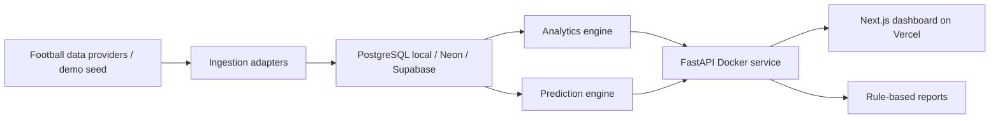

# Architecture

The Scout's Edge is an automated football analytics pipeline that ingests match and event data, computes tactical and predictive metrics, and presents scouting-style insights through a full-stack dashboard.

## System Overview

## Backend Architecture

The backend is a FastAPI application with small service modules:

- `ingestion`: provider interfaces for mock data, StatsBomb Open Data-style files, and future API-Football integration.
- `models`: SQLAlchemy 2.x models for football data, predictions and generated reports.
- `analytics`: deterministic event calculations for shot maps, possession chains, set pieces and player involvement.
- `predictions`: transparent models for match results, tournament simulation, scorers, goal types and player awards.
- `reports`: a rule-based narrative service that only summarizes calculated backend data.
- `api`: route modules grouped by domain.

## Frontend Architecture

The frontend is a Next.js app router dashboard. Server components fetch backend API data for the main pages. Client components are used only where interactivity or charts are needed, such as Recharts and shot-map rendering.

## Database Design

PostgreSQL stores:

- Core data: competitions, seasons, teams, players, matches, lineups, events, shots, possessions, team/player match stats.
- Prediction data: team ratings, player rating features, match predictions, tournament simulations, scorer predictions, goal-type predictions.
- Reports: generated scouting reports with markdown content and source payload metadata.

## Data Ingestion Flow

`FootballDataProvider` defines the stable contract:

- `get_fixtures`
- `get_match_events`
- `get_lineups`
- `get_player_stats`
- `get_team_stats`
- `get_standings`

The MVP uses `MockWorldCupDataProvider` and a 48-team demo tournament dataset for engineering purposes. This dataset is not official FIFA fixture data. `StatsBombOpenDataProvider` and `ApiFootballProvider` are scaffolded so live integrations can be added without rewriting analytics.

## Prediction Flow

Team ratings feed the match expected-goals model. Expected goals feed a Poisson-style scoreline grid. Match probabilities feed the tournament Monte Carlo simulator. Player scoring features and team expected goals feed scorer candidate estimates. Team threat profiles and opponent weaknesses feed goal-type probabilities.

## Tournament Flow

The tournament engine creates 12 groups of 4 teams and generates 72 group-stage fixtures. Each simulation run:

- simulates every group match with expected goals and Poisson-sampled goals;
- sorts group tables by points, goal difference, goals scored and seeded rating fallback;
- advances the top 2 from each group;
- ranks all third-place teams and advances the best 8;
- builds a deterministic Round of 32 bracket;
- simulates Round of 32, Round of 16, quarter-finals, semi-finals and final;
- records stage probabilities and average group-stage points/goals for every team.

The single-run simulation flow reuses the same match and tournament mechanics for one deterministic-or-random run, then adds player-event allocation:

```mermaid
flowchart LR
  Seed["Optional seed"] --> MatchModel["Expected-goals match model"]
  MatchModel --> GroupRun["Simulated group stage"]
  GroupRun --> ThirdPlace["Best third-place ranking"]
  ThirdPlace --> Knockout["Knockout bracket path"]
  Knockout --> PlayerEvents["Goal and assist allocation"]
  PlayerEvents --> Awards["Golden Boot and MVP"]
  Awards --> API["POST /tournament/simulate/run"]
  API --> UI["Single Tournament Simulation tab"]
```

## Future n8n Automation Flow

n8n can later orchestrate scheduled ingestion, report generation and notifications. It should call the backend API rather than becoming the core analytics engine.

## Deployment Plan

Local development uses Docker Compose for PostgreSQL, FastAPI and Next.js. Production should not try to deploy Docker Compose directly to Vercel.

The intended production architecture is:

- Next.js dashboard on Vercel.
- PostgreSQL on Neon Postgres or Supabase Postgres.
- FastAPI backend deployed as a Docker-compatible service on Render, Railway, Fly.io, or a VPS.
- `NEXT_PUBLIC_API_BASE_URL` in Vercel points at the hosted FastAPI URL.
- `DATABASE_URL` in the backend host points at Neon or Supabase.
- `CORS_ORIGINS` in the backend host includes the Vercel dashboard domain.

Future production hardening should add object storage for raw event files, migration execution in CI/CD, observability, and provider-specific deployment manifests.
