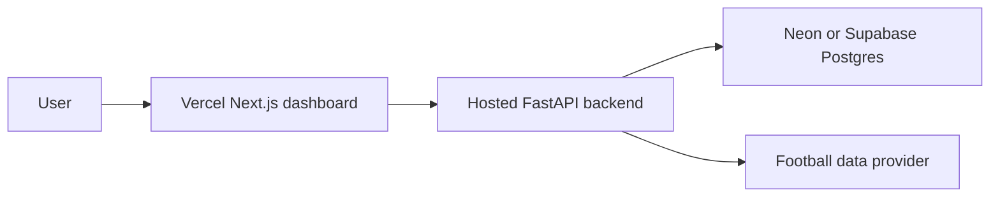

# Deployment

The Scout's Edge uses different architecture for local development and production.

## Local Development

Use Docker Compose locally:

```bash
cp .env.example .env
make docker-up
make migrate
make seed-world-cup
```

This starts:

- PostgreSQL on `localhost:5432`
- FastAPI on `localhost:8000`
- Next.js on `localhost:3000`

Docker Compose is not the production architecture and should not be treated as something Vercel can deploy directly.

## Production Architecture

Use this split:

- Frontend: Vercel, using the `frontend/` directory as the project root.
- Database: Neon Postgres or Supabase Postgres.
- Backend: Docker-compatible FastAPI service deployed to Render, Railway, Fly.io, or a VPS.

This deployment split stays the same as the tournament simulation grows. The 48-team demo dataset and simulation code live in the FastAPI backend; the Vercel dashboard consumes the hosted API through `NEXT_PUBLIC_API_BASE_URL`.



## Vercel Frontend

Create a Vercel project with `frontend/` as the root directory.

Set:

```text
NEXT_PUBLIC_API_BASE_URL=https://your-fastapi-service.example.com
```

The frontend should not connect directly to Postgres. It should call the FastAPI API.

## Hosted Postgres

Use Neon Postgres or Supabase Postgres and copy the pooled production connection string.

Set on the backend host:

```text
DATABASE_URL=postgresql+psycopg://...
```

Run Alembic migrations against the hosted database before seeding or serving production traffic.

## FastAPI Backend

The backend remains Docker-compatible through `backend/Dockerfile`. Deploy it to Render, Railway, Fly.io, or a VPS.

Set:

```text
ENVIRONMENT=production
DATABASE_URL=postgresql+psycopg://...
CORS_ORIGINS=https://your-vercel-app.vercel.app
FOOTBALL_DATA_PROVIDER=mock
API_FOOTBALL_KEY=
```

For the MVP, `FOOTBALL_DATA_PROVIDER=mock` keeps the app demoable without paid credentials. Later, switch to a live provider after implementing the adapter.

## Production Checklist

- Deploy Postgres on Neon or Supabase.
- Deploy FastAPI as a Docker service.
- Run `alembic upgrade head` on the backend host.
- Run the seed script if using demo data.
- Deploy the Next.js dashboard to Vercel.
- Set Vercel `NEXT_PUBLIC_API_BASE_URL` to the backend URL.
- Set backend `CORS_ORIGINS` to the Vercel URL.
- Verify `GET /health` from the browser and from Vercel server rendering.
