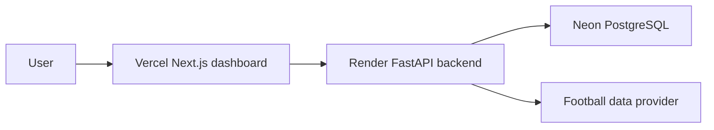

# Deployment

The Scout's Edge uses different architecture for local development and production. The public portfolio deployment is live at:

- Frontend: https://scouts-edge.vercel.app
- Tournament page: https://scouts-edge.vercel.app/tournament
- Backend API: https://scouts-edge.onrender.com
- API health: https://scouts-edge.onrender.com/health
- API docs: https://scouts-edge.onrender.com/docs

The backend/database are hosted on free-tier infrastructure, so the first request may take a few seconds to wake up.

## Local Development

Use Docker Compose locally:

```bash
cp .env.example .env
make docker-up
make migrate
make seed-world-cup
```

This starts:

- PostgreSQL on `localhost:5432`
- FastAPI on `localhost:8000`
- Next.js on `localhost:3000`

Docker Compose is not the production architecture and should not be treated as something Vercel can deploy directly.

## Production Architecture

The live deployment uses this split:

- Frontend: Vercel, using the `frontend/` directory as the project root.
- Database: Neon Postgres.
- Backend: Docker-compatible FastAPI service deployed to Render.

This deployment split stays the same as the tournament simulation grows. The 48-team demo dataset and simulation code live in the FastAPI backend; the Vercel dashboard consumes the hosted API through `NEXT_PUBLIC_API_BASE_URL`.



## Vercel Frontend

Create a Vercel project with `frontend/` as the root directory.

Set:

```text
NEXT_PUBLIC_API_BASE_URL=https://scouts-edge.onrender.com
```

The frontend should not connect directly to Postgres. It should call the FastAPI API.

## Hosted Postgres

Use Neon Postgres and copy the pooled production connection string.

Set on the backend host:

```text
DATABASE_URL=<Neon connection string>
```

Run Alembic migrations against the hosted database before seeding or serving production traffic.

## FastAPI Backend

The backend remains Docker-compatible through `backend/Dockerfile`. It is deployed to Render at https://scouts-edge.onrender.com.

Set:

```text
ENVIRONMENT=production
DATABASE_URL=<Neon connection string>
CORS_ORIGINS=https://scouts-edge.vercel.app,http://localhost:3000,http://localhost:3001,http://127.0.0.1:3000,http://127.0.0.1:3001
FOOTBALL_DATA_PROVIDER=mock
API_FOOTBALL_KEY=
```

For the MVP, `FOOTBALL_DATA_PROVIDER=mock` keeps the app demoable without paid credentials. Later, switch to a live provider after implementing the adapter.

## Production Checklist

- Deploy Postgres on Neon.
- Deploy FastAPI as a Docker service.
- Run `alembic upgrade head` on the backend host.
- Run the seed script if using demo data.
- Deploy the Next.js dashboard to Vercel.
- Set Vercel `NEXT_PUBLIC_API_BASE_URL` to the backend URL.
- Set backend `CORS_ORIGINS` to the Vercel URL.
- Verify `GET /health` from the browser and from Vercel server rendering.

## CI/CD

- GitHub Actions runs backend pytest, backend Ruff lint checks and the frontend production build.
- Vercel deploys frontend changes from GitHub.
- Render deploys backend changes from GitHub according to the Render service settings.
- Environment-specific values are configured in Vercel, Render and Neon; secrets are not committed.

## Operational Notes

- Closing a local browser or laptop does not stop the hosted deployment.
- Render/Neon free-tier services may sleep and wake on the first request.
- New commits to `main` can trigger redeploys depending on Vercel and Render settings.
- If the Neon database is reset or recreated, run migrations and seed data again before relying on the hosted API.
